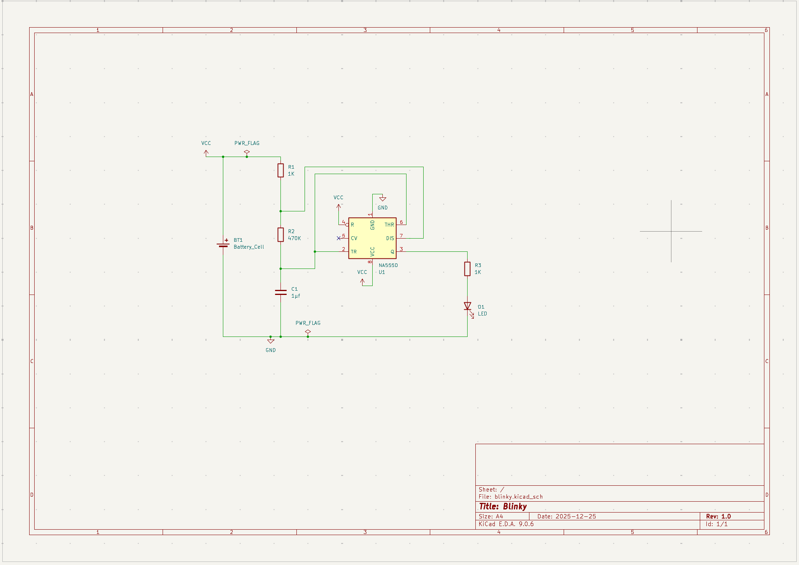
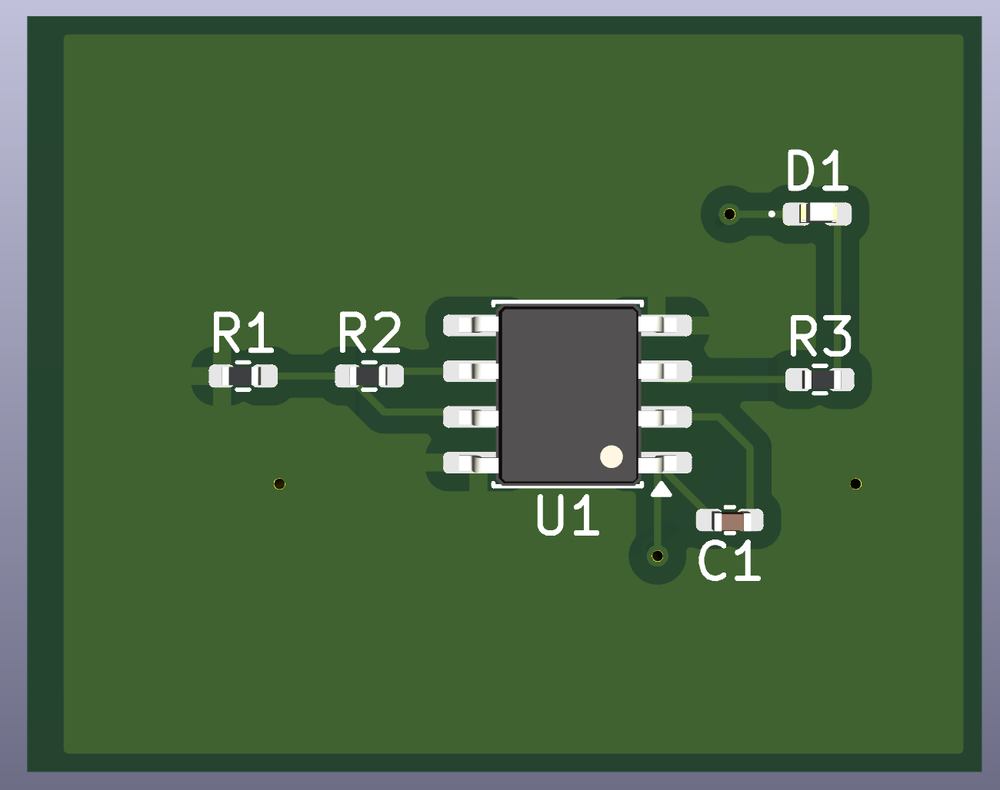
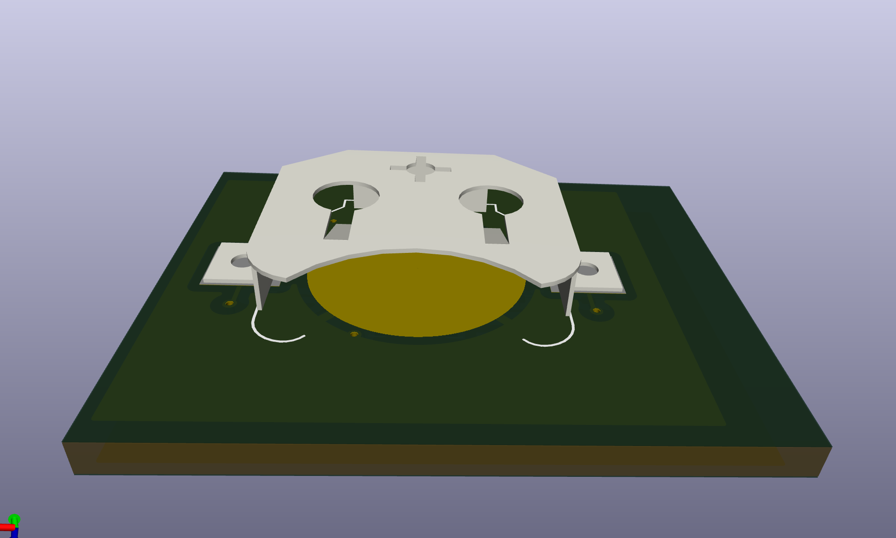

# Blinky

This is a simple LED blinking circuit created with KiCad. This board is the final project in the [Getting to Blinky](https://contextualelectronics.com/courses/getting-to-blinky-5-0/) course offered by Contextual Electronics.

## Images

### Schematic

### PCB Layout (Top)

### PCB Layout (Bottom)

